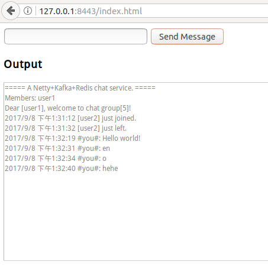
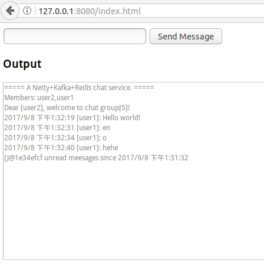

# Chat
A simple scalable chat service, based on [netty](http://netty.io), [kafka](http://kafka.apache.org/) and [redis](https://redis.io/).
## Build
* [Maven](http://maven.apache.org/)
* [JDK 8](http://www.orScalableacle.com/technetwork/java/).
## Dependencies
* zookeeper 3.4.10
* kafka 2.11-0.11 
* redis 4.0
## Running chat server
First compile the project and package into a tar ball.
```bash
mvn clean package
cd target
tar zxvf chat-1.0-SNAPSHOT-ALL.tar.gz
cd chat-1.0-SNAPSHOT-ALL
```
Start a chat server.
```bash
./start
```
127.0.0.1:`8080`/chat?user=`user1`&group=1&token=1234


Start another chat server with self defined properties file.
```bash
./start config=~/config.properties
```
127.0.0.1:`8081`/chat?user=`user2`&group=1&token=1234

